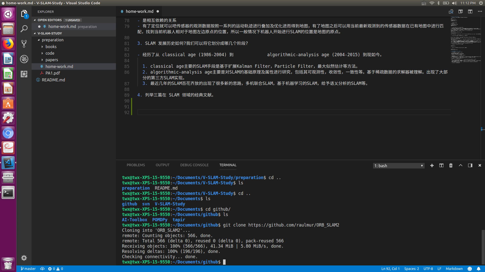

# 2 熟悉 Linux (2 分,约 2 小时)
1. 如何在 Ubuntu 中安装软件(命令行界面)? 它们通常被安装在什么地方?
```
16.04:
sudo apt install xxx
或
sudo apt-get install xxx 
14.04及以下版本：
sudo apt-get install xxx
```

```
如果是库的话一般安装在：
/usr/lib/
/usr/include/
如果是可执行程序一般安装在：
/usr/bin/
程序相应的一些配置文件：
/etc/

```
2. linux 的环境变量是什么?我如何定义新的环境变量?

如果把系统看成一个大程序，那么环境变量就是这个大程序的一些全局变量，而且这些全局变量都是用户可访问可修改的。
比如：PATH这个最常见的环境变量就是申明和储存一些路径，然后在终端环境下，PATH中所储存的路径下的所有可执行程序都可以不需要路径直接访问
比如ls这个常见命令，就是在/bin 这目录下，而/bin这个目录是在PATH环境变量中的一个路径。

定义新的环境变量可以在命令行中或者在HOME目录下的.bashrc 或.zshrc 或各种rc文件中，比如：
在命令行中执行： 
```
export MY_ENV_VAR=10   （当前session下有效）
```
或者在.bashrc中最下方写： 
```
export MY_ENV_VAR=10   （永久有效，其实也不是，只不过每开一个新session系统都会执行 source .bashrc, 有点像开机启动脚本一样）
```

3. linux 根目录下面的目录结构是什么样的?至少说出 3 个目录的用途。

```
bin   cdrom  etc   initrd.img      lib    lost+found  mnt  proc  run   snap  sys  usr  vmlinuz
boot  dev    home  initrd.img.old  lib64  media       opt  root  sbin  srv   tmp  var  vmlinuz.old
```
以上是一个ubuntu 16.04常见的目录结构
/bin，/usr/bin, /usr/local/bin, /usr/sbin 都是储存可执行的地方，并且都在PATH环境变量中，所以这些文件夹里面的程序都是可以在终端直接呼出执行的，不需要加绝对路径

/etc 是系统自身的配置和用户程序的配置文件，比如开机启动相关配置，网络相关配置，系统服务相关配置，用户控制相关配置等等等。
/media 是多媒体媒介插入计算机后挂在的位置，一般优盘插入计算机后或者这里找到一个相应的文件夹
/usr 这个是用户资源目录，包含一些系统预装的程序及库文件，以及用户后来自己安装的程序和库文件，比如头文件，*.so, *.a, 可执行程序等等。
/dev 是专门存放外界设备对应的文件句柄的目录，linux中任何东西都是文件，包括你的打印机，网卡，网络借口等等，甚至cpu状态都在文件中找得到。

以上纯手写没有任何粘贴，都是在自己脑子里的东西，也没有差任何资料。所以就先写这么多吧。

4. 假设我要给 a.sh 加上可执行权限,该输入什么命令?

```
cd path/to/a.sh
sudo chmod +x a.sh
```

5. 假设我要将 a.sh 文件的所有者改成 xiang:xiang,该输入什么命令?

```
cd path/to/a.sh
sudo chown xiang:xiang a.sh
```

# 3 SLAM 综述文献阅读 (3 分,约 3 小时)

1. SLAM 会在哪些场合中用到?至少列举三个方向。
    
- 救援机器人或者各种移动式机器人
- 自动驾驶，需要比较稠密的地图来进行较高精度的定位
- 未知环境的探索，行星，航空，海洋，陆地等的探索

2. SLAM 中定位与建图是什么关系?为什么在定位的同时需要建图?

- 是相互依赖的关系
- 有了定位就可以吧传感器的观测数据按照一系列的运动轨迹进行叠加及优化进而得到地图，有了地图之后可以用当前最新观测到的传感器数据在已有地图中进行匹配，找到当前机器人相对于地图左边原点的位置，所以一般情况下机器人开始进行SLAM的位置是地图的原点。

3. SLAM 发展历史如何?我们可以将它划分成哪几个阶段?

- 经历了从 classical age (1986-2004) 到             algorithmic-analysis age (2004-2015) 到现如今。

  1. classical age主要的SLAM手段是基于扩展Kalman Filter，Particle Filter，最大似然估计等方法。
  2. algorithmic-analysis age主要是对SLAM的基础原理及属性进行研究，包括其可观测性，收敛性，一致性等。基于稀疏数据的求解器被理解。出现了大部分的第三方SLAM实现。
  3. 最近几年的SLAM百花齐放的出现了很多新的思路，多机联合SLAM，基于机器学习的SLAM，给予语义分析的SLAM等。
  
4. 列举三篇在 SLAM 领域的经典文献。

# 4 CMake 练习 (2 分,约 1.5 小时)

CMakeLists.txt can be found under code/ folder


# 5 理解 ORB-SLAM2 框架 (3 分,约 2 小时)
1. 
2. 阅读 ORB-SLAM2 代码目录下的 CMakeLists.txt,回答问题:

  - （a）ORB-SLAM2 将编译出什么结果?有几个库文件和可执行文件?
    - 动态库：libORB_SLAM2.so 
    - 可执行：rgbd_tum 
    - 可执行：stereo_kitti 
    - 可执行：stereo_euroc 
    - 可执行：mono_tum 
    - 可执行：mono_kitti 
    - 可执行：mono_euroc
  - （b）ORB-SLAM2 中的 include, src, Examples 三个文件夹中都含有什么内容?
    - include 包含所有的头文件定义，头文件中定义了很多算法需要的数据结构和承载算法逻辑的类。
    - src 包含了所有的逻辑实现文件，简称C++源文件，上题目中的每个编译产物对应该文件夹下的一个或多个源文件。
    - Examples 包含了利用ORB_SLAM算法库实现的几种使用不同传感器输入源的SLAM:
      1. 单目：Monocular 使用了三种数据集来测试结果（KITTI,EuRoC,TUM）
      2. 双目:Stereo 使用了两种数据集来测试结果（KITTI,EuRoC）
      3. 深度摄像头:RGBD 使用了一种数据源来测试结果（TUM）

      还有个ROS目录使用了ROS兼容的数据接收方式（Topic）来实现了上述三种程序
  - （c）ORB-SLAM2 中的可执行文件链接到了哪些库?它们的名字是什么?
    - OpenCV 视觉处理库
    - EIGEN3 矩阵处理库
    - Pangolin 可视化工具库
    - ros 编译Example中的ROS目录下的程序时用到的ROS框架的依赖

# 6 使用摄像头或视频运行 ORB-SLAM2(3 分,约 1 小时)