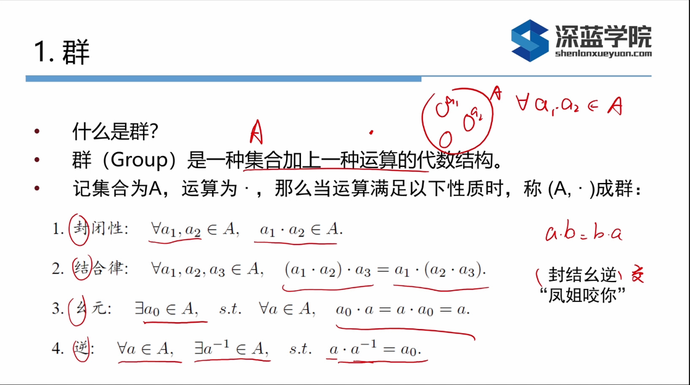
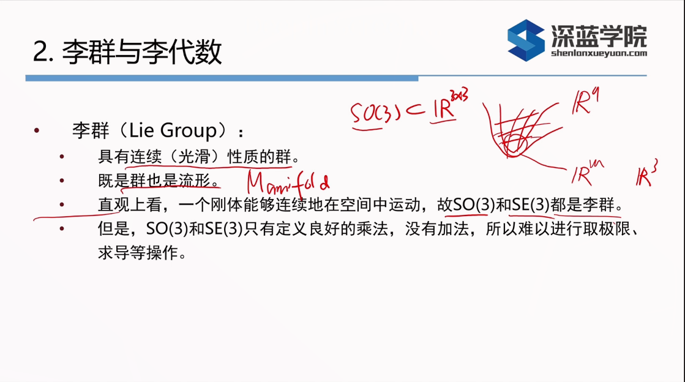
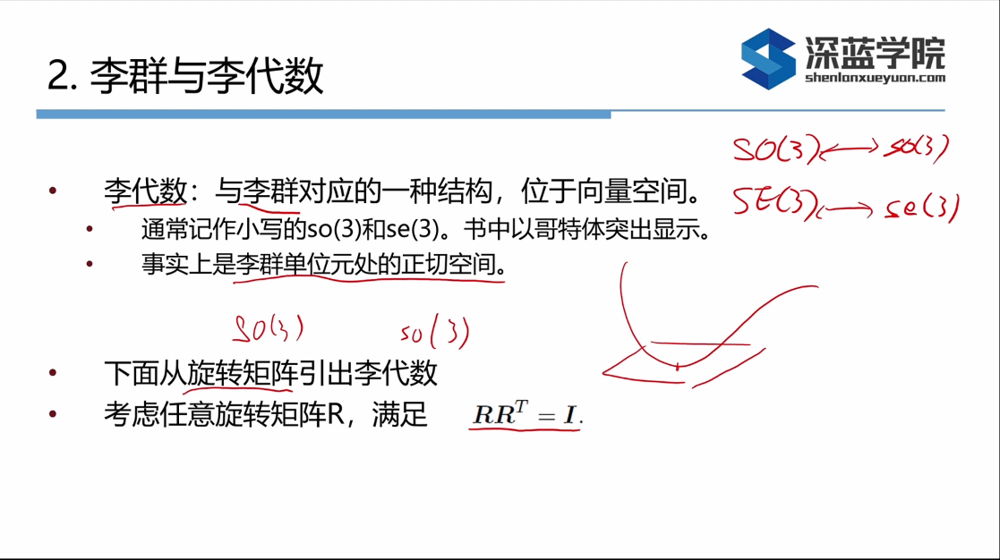

# Why we need Lie Group
Some time we need compute $\frac{D(F(R))}{DR} = \frac{F(R + \varDelta r) - F(R)} {\varDelta r} | \varDelta  r \in SO(3)$
but R doesn't support add operation, so its hard to compute derivative of F(R)

# SO, Special Orthogonal Group
Rotation matrix $R \in SO(3)$ and have:
$SO(3) = \{R \in \R^{3 \times 3} | RR^{T}=I,\det(R) = 1\}$

# Rotation Matrix and Transform Matrix
Rotation matrix R only representing rotation it could transform to Angle axis or Rotation vector
Transform matrix can represent both Rotation and Transform:
$
SE(3) = \{ T = 
\begin{bmatrix}
   R & t \\
   0^{T} & 1
\end{bmatrix} \in \R^{4 \times 4} | R \in SO(3), t \in \R^3
\}
$
# Definition of Group

# Definition of Lie Group

# Definition of Lie Algebra

# Relationship between Lie Group and Lie Algebra
